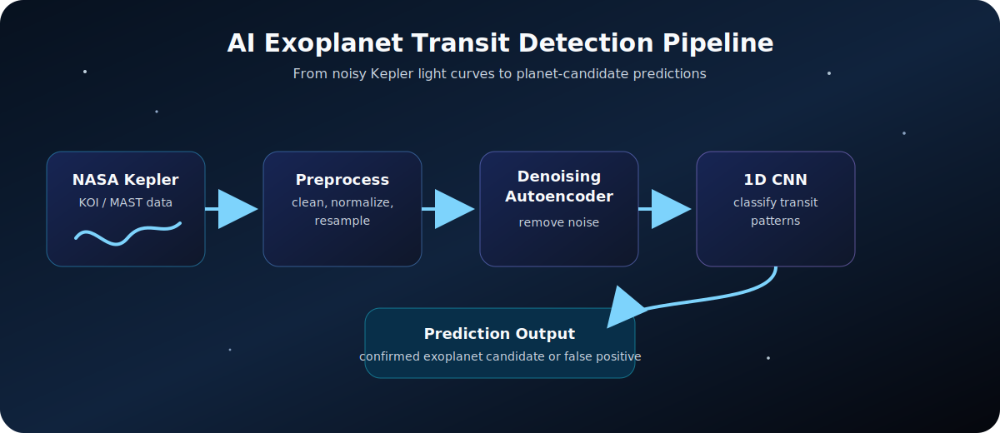
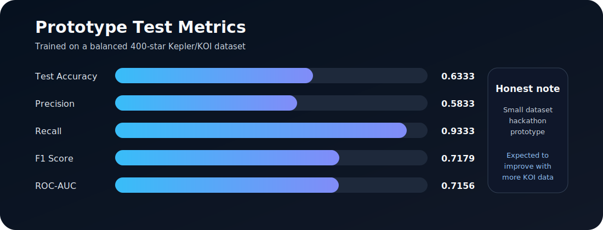

# AI Exoplanet Transit Detection Pipeline

An end-to-end deep learning pipeline that detects exoplanets from noisy Kepler space telescope light curve data.

This project was built as a hackathon prototype to demonstrate how raw astronomical time-series data can be fetched, cleaned, denoised, and classified with deep learning. The pipeline combines a denoising autoencoder with a convolutional neural network classifier to identify transit-like patterns in stellar brightness measurements.



## Architecture Overview

The system uses a two-stage deep learning pipeline:

1. **Denoising autoencoder**: Learns to reconstruct cleaner light curves from noisy stellar flux measurements. This helps suppress measurement noise, stellar variability, and other artifacts that can obscure small transit dips.
2. **CNN classifier**: Takes the denoised light curve and predicts whether the signal is more consistent with a confirmed planet candidate or a false positive.

Simple data flow:

```text
NASA Kepler / KOI data
        |
        v
Raw light curve CSV
        |
        v
Preprocessing
- remove NaNs and outliers
- normalize flux
- resample to fixed length
        |
        v
Denoising Autoencoder
        |
        v
Cleaned light curve representation
        |
        v
1D CNN Classifier
        |
        v
Prediction: confirmed exoplanet candidate or false positive
```

## Dataset

The dataset is built from NASA Kepler and KOI light curve sources, using public NASA data services including MAST and the NASA Exoplanet Archive.

For this prototype, the training set contains:

- **400 stars total**
- **Balanced split** between confirmed exoplanet candidates and false positives
- Kepler light curve data downloaded and processed into model-ready time-series arrays

This modest dataset size was chosen for hackathon speed and feasibility. The same pipeline can be scaled to a much larger KOI sample for stronger generalization.

## Results



Current test-set metrics:

| Metric | Score |
| --- | ---: |
| Test Accuracy | 0.6333 |
| Precision | 0.5833 |
| Recall | 0.9333 |
| F1 Score | 0.7179 |
| ROC-AUC | 0.7156 |

These results are honest prototype metrics from a model trained on a relatively small dataset of 400 stars. The high recall indicates that the classifier is good at catching many likely planet signals, while the lower precision shows that it still flags some false positives.

Accuracy and precision could improve with:

- A larger and more diverse training set
- Better class balancing across KOI dispositions
- Additional feature engineering, such as periodogram features or transit-shape statistics
- More robust validation across different Kepler quarters and target types
- Hyperparameter tuning and model ensembling

## Tech Stack

- Python
- TensorFlow / Keras
- Lightkurve
- Gradio
- NASA MAST APIs
- NASA Exoplanet Archive APIs
- NumPy, Pandas, Matplotlib, Astropy, scikit-learn

## Folder Structure

```text
AI exoplanet detection/
|
|-- data/
|   |-- labels.csv
|   |-- download_data.py
|   |-- preprocess_data.py
|   |-- build_training_set.py
|
|-- models/
|   |-- train_denoiser.py
|   |-- train_classifier.py
|   |-- saved_models/
|       |-- denoiser.keras
|       |-- classifier.keras
|
|-- demo/
|   |-- app.py
|
|-- assets/
|   |-- architecture.svg
|   |-- results.svg
|
|-- requirements.txt
|-- verify_setup.py
|-- README.md
```

## Setup and Installation

Clone the repository:

```bash
git clone https://github.com/sahariya-divyansh/exoplanet-detector.git
cd exoplanet-detector
```

Create and activate a virtual environment:

```bash
python -m venv venv
```

On Windows:

```bash
venv\Scripts\activate
```

On macOS/Linux:

```bash
source venv/bin/activate
```

Install dependencies:

```bash
pip install -r requirements.txt
```

Run the local Gradio demo:

```bash
python demo/app.py
```

Then open the local URL printed by Gradio in your browser. In the current demo configuration, the app runs at:

```text
http://127.0.0.1:7862
```

## Live Demo

[DEMO LINK HERE]

## How It Works

1. The user enters a Kepler target name or catalog identifier in the Gradio demo.
2. The app fetches light curve data using Lightkurve.
3. The preprocessing pipeline removes invalid points, normalizes flux, and resamples the curve to a fixed length.
4. The denoising autoencoder reconstructs a cleaner signal.
5. The CNN classifier estimates the probability of a planet-like transit signal.
6. The demo returns a prediction and diagnostic plots for inspection.

## Credits and Acknowledgments

This project relies on open astronomical data made available through NASA's open data programs, including the Kepler mission, the Mikulski Archive for Space Telescopes (MAST), and the NASA Exoplanet Archive.

Special thanks to the scientific and open-source communities behind Lightkurve, Astropy, TensorFlow, Keras, and Gradio for making space-data experimentation more accessible.
